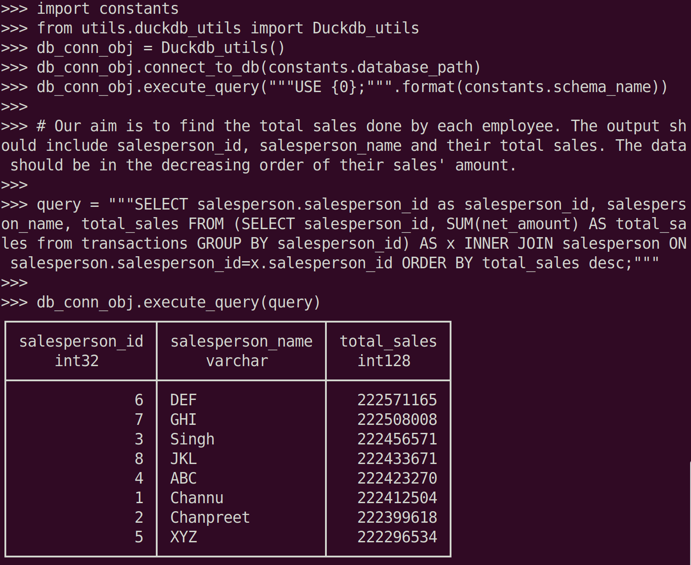
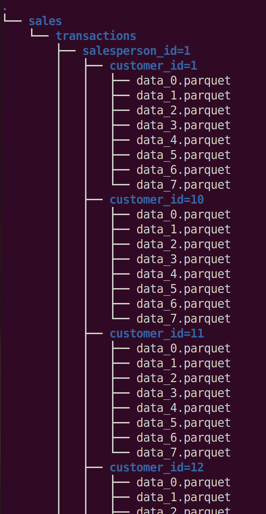
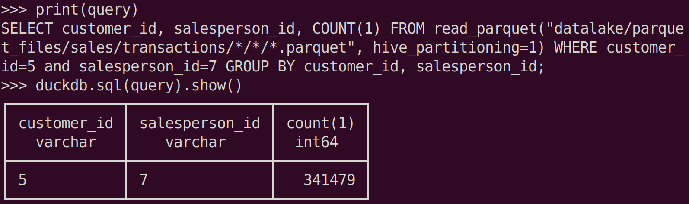
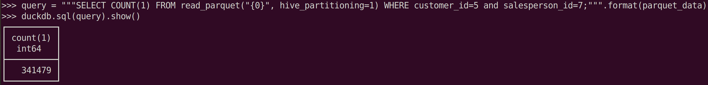

**Setting up the project**: 
Make sure you have python3.8 or python3.9 in your system and create a virtual environment as ***venv*** and all the libraries are installed using, 
`source venv/bin/activate; pip install -r requirements.txt`

**For creating synthetic data**, 
`source venv/bin/activate; python -m scripts.random_data_generator`

### **Pipeline-1: Ingesting data from csv files into duckdb(persisted storage)** 
Command to execute: `source venv/bin/activate; dagster dev -m pipelines.ingest_sales_data`

After the execution on pipeline-1, we can perform some queries on the ingested data as given below 

 
### **Pipeline-2: Creating partitioned parquet files from duckdb files**
Command to execute: `source venv/bin/activate; dagster dev -m pipelines.export_duckdb_data_into_partitioned_parquet` 
We have partitioned the data on the basis of customer_id and salesperson_id. To verify this, use the commend `tree -a`
 

 
**Querying partitioned parquet files**, 
Our problem is to find total number items sold by salesperson_id=7 to customer_id=5. 

 
Also, We can directly count the number of rows in the partitioned data, salesperson_id=7 to customer_id=5; thus query performance is slightly improved as there is no group by operation. Also, the output can be verified from the above query where group by is involved. 

