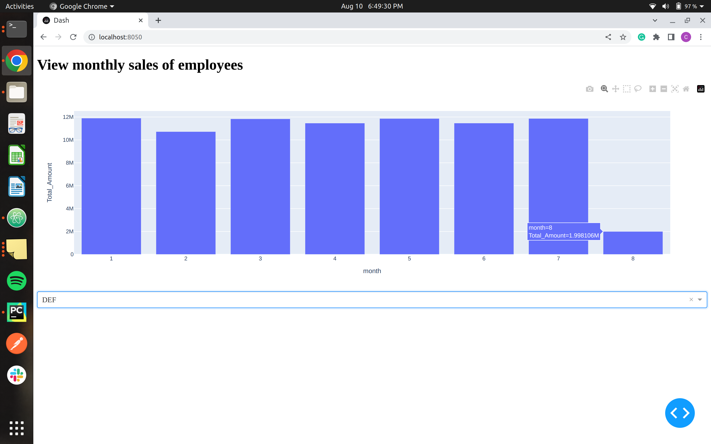

**This readme is specifically for the dashboard**: 
It is an interactive dashboard to view monthly sales of employees in the year 2023. A dropdown is provided to select the employee and a bar graph is shown. 

Make sure you are in the home directory to execute the command below 
`source venv/bin/activate; python -m dashboard.app` 

Below are 3 screenshots for 3 different employees - ABC, DEF and XYZ. 
Please note that, the dashboard is made on the synthetic data and the sales' amount is very close to each other with respect to the employees. Hence, in the screenshots, I've hovered over month=8 to view the exact sales amount to make it noticeable. 

**For Employee: ABC**, 
  
**For Employee: DEF**, 
  
**For Employee: XYZ**, 

